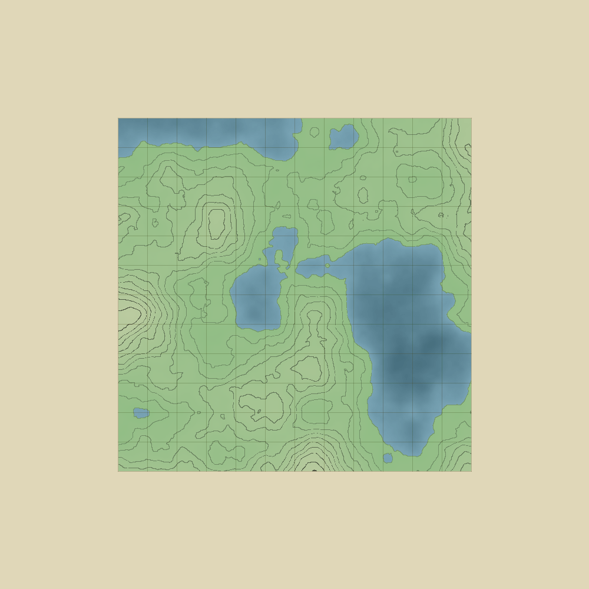
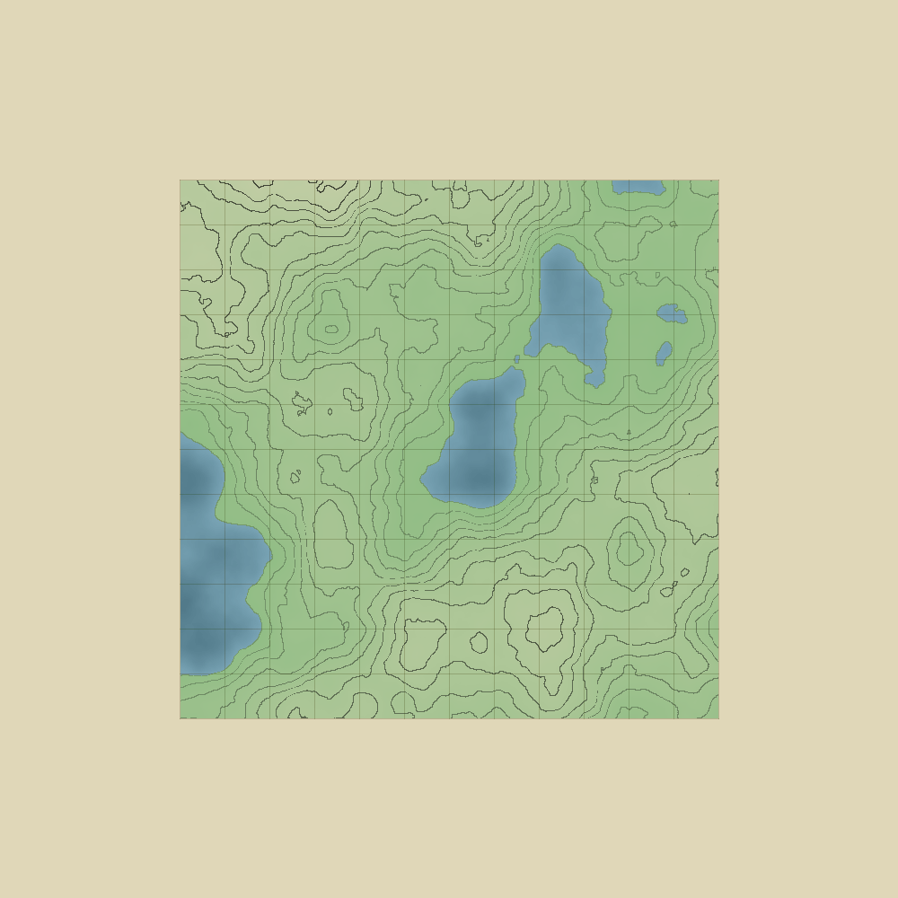
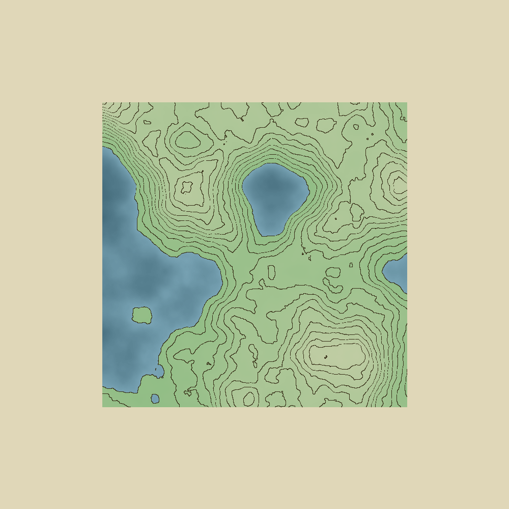
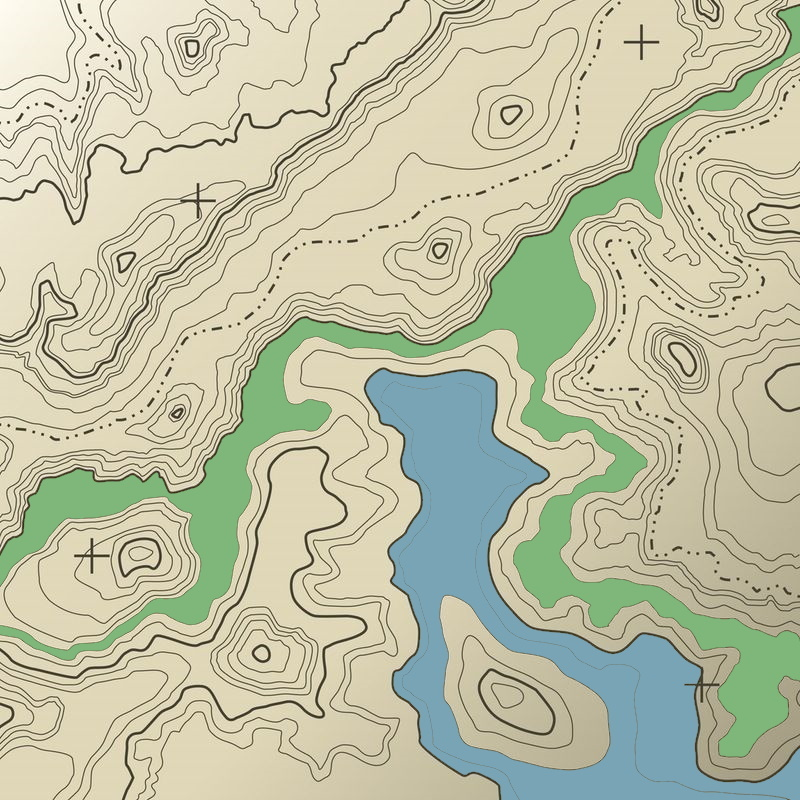
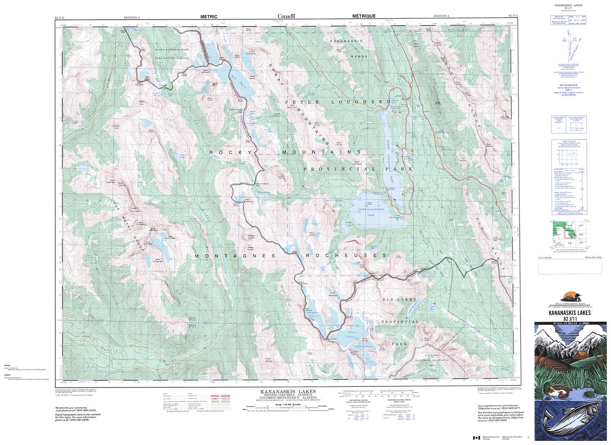

# Landscapes

Makes a procedurally generated topographic map using Processing 3 and P5.JS like so:

### Perlin Noise
Most landscape / terrain generation is based upon Perlin Noise, a type of "smooth" random function. 
Perlin noise can be added at different levels of detail to create a natural looking terrain.

### How it works
First, a 2D array of floats is filled with values from the perlin noise function to represent height.
Then, each pixel is colored based upon the height values. If the height is at a certain height that corresponds to a "band", it is colored dark, which creates the topographical lines. If the height value is less than a certain threshold, it is blue. The final color is blended based upon its height to create a shaded look. 

One consideration I needed to take was to only consider a pixel as part of a "band" if the steepness at that point was over a certain threshold. Each pixel checks the heights around it to see if it is steep enough. Otherwise, flat areas could be colored dark if they were at the right height, as opposed to the clean topographical lines that define the sharp edge of a height region.

### Some reference images I was inspired by

